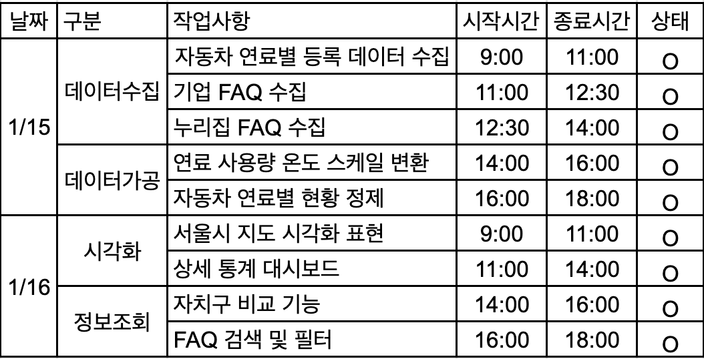
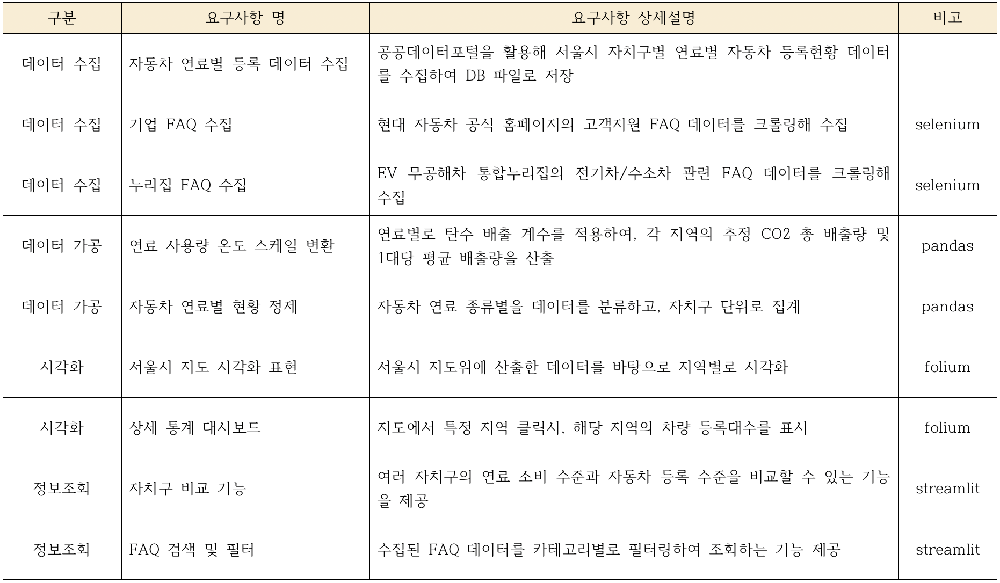
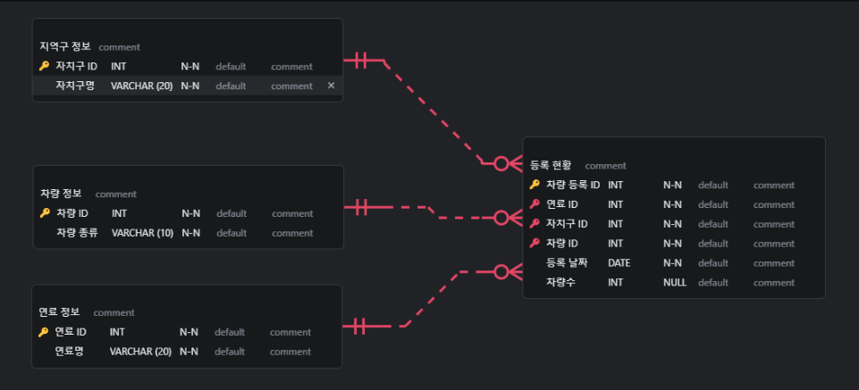
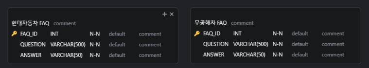
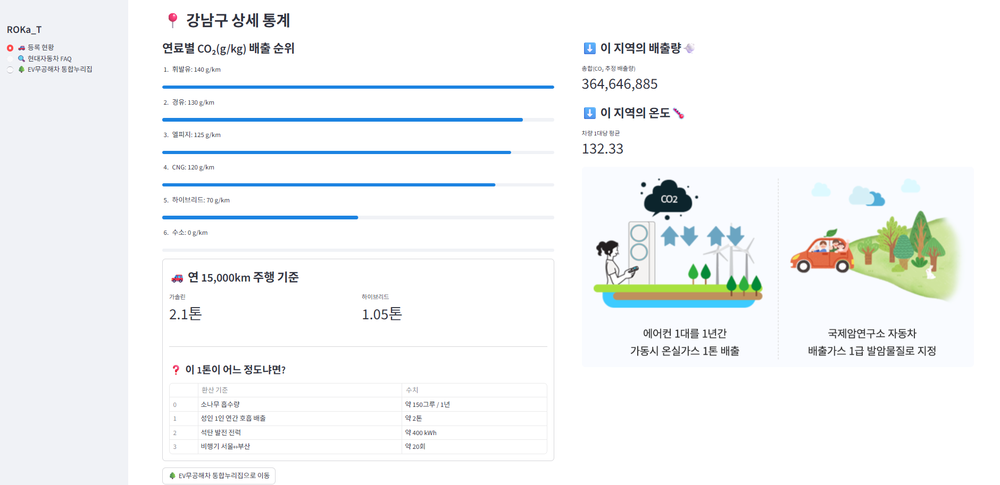
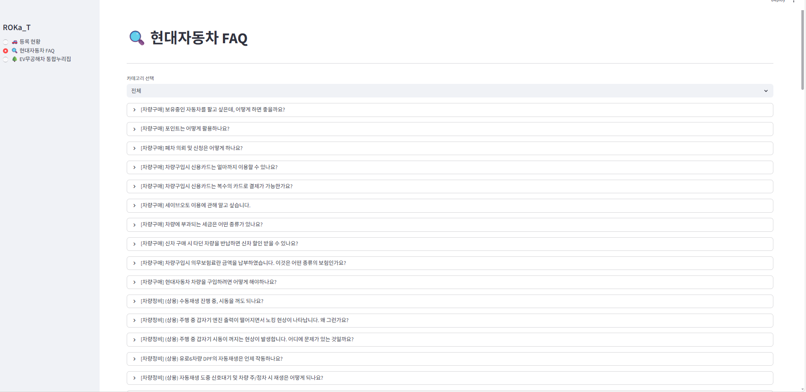
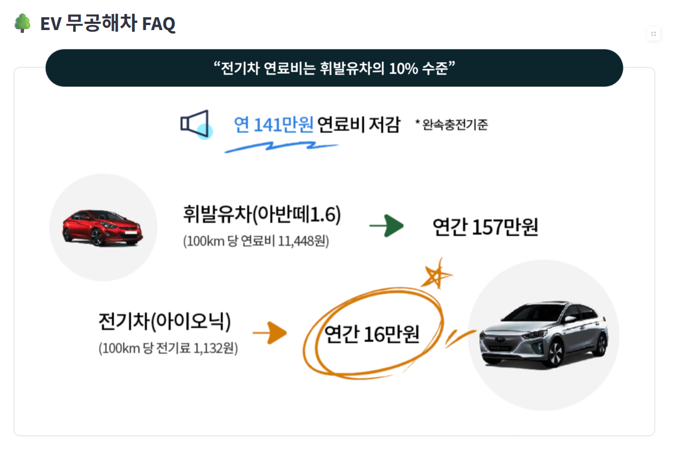
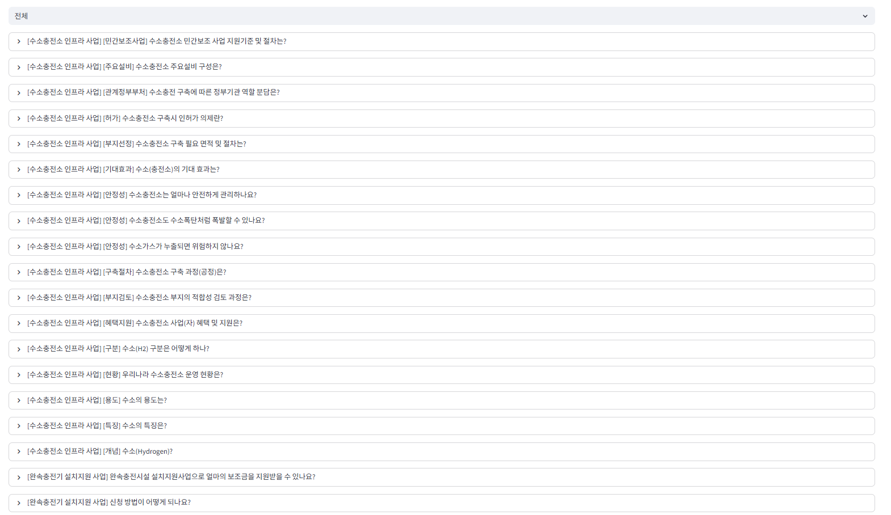

# 🚗 ROKa-T: Republic Of Korea Automobile Thermometer

> < **"차량 등록 데이터로 측정하는 도시 환경오염의 지표"** > 
---

## 1. 팀 소개 🦷
**팀명 : TOOTH 사이에 낀 1**

| 아바타 |  |  |  |  |  |
| :---: | :---: | :---: | :---: | :---: | :---: |
| 이름 | **김민준** | **정석원** | **최하진** | **최현진** | **황인규** |
| GitHub | [🔗 miin-jun](https://github.com/miin-jun) | [🔗 JeongSW123](https://github.com/JeongSW123) | [🔗 hun668486](https://github.com/hun668486) | [🔗 lifeisgoodlg](https://github.com/lifeisgoodlg) | [🔗 hwang-in-kyu](https://github.com/hwang-in-kyu) |

---

## 2. 프로젝트 개요

### 📍 프로젝트 정보
* **진행 기간 :** 2026.01.15 ~ 2026.01.16
* **핵심 컨셉 :** 서울시 자치구별 자동차 연료 소비 데이터를 시각화 하여 이산화 탄소 배출량과 비교

### 🌱 프로젝트 소개
**로카티는 대한민국 서울시 자치구별 자동차 등록 데이터를 연료별로 나눠, 각 지역이 배출하는 탄소의 양을 < 지구의 온도 > 형태로 시각화한 프로젝트입니다!**
* 서울시 자치구별에 등록되어있는 연료별 차량 등록대수 확인 가능
* 수소, 전기차와 관련된 FAQ와 현대자동차 FAQ 확인 가능

### 🎯 프로젝트 필요성
* **기후위기 체감부족 :** 심각한 지구 온난화, 하지만 눈에 보이지 않는 자동차 배출가스. 단순 수치 데이터가 아닌 '온도'라는 시각적 지표로 환경 오염을 체감하게 합니다.
* **지역별 데이터 격차 해소 :** 자치구별 상이한 연료 소비 구조와 오염도를 한눈에 비교하여, 우리 지역의 '환경 현주소'를 직관적으로 파악합니다.
* **친환경차 전환의 진입장벽 제거 :** 흩어져 있는 **충전 인프라 정보와 자동차 FAQ**를 통합 제공하여, 궁금증을 해소하고 합리적인 친환경차 구매를 돕습니다.

### 🌷 기대효과
* **데이터 기반의 지역 맞춤형 전략 수립** : 단순 등록 대수를 넘어 **지역별 환경 온도**를 산출합니다. 이를 통해 친환경차 보급과 인프라 확충이 시급한 지역을 식별하고, 실효성 있는 환경 정책 수립에 기여합니다.
* **친환경 소비 행동 유도** : 자동차로 인한 오염도를 시각적으로 체감하게 하여, 사용자가 차기 차량 구매 시 **전기·수소차를 선택하거나 대중교통을 이용**하도록 동기를 부여합니다.
* **정보 전달 및 진입장벽 해소** : 핵심 **FAQ(충전, 유지비 등)**를 분석·제공하여 예비 구매자의 궁금증을 해소하고, 친환경차 시장으로의 진입 장벽을 낮춥니다.

### 👥 주요 타겟 사용자
* **🏛 지자체 담당자** : 서울시 및 구청 환경·교통 정책 수립 기초 자료 활용.
* **⚡ 기업 기획자** : EV 충전소, 수소차 등 친환경 모빌리티 비즈니스 기획.
* **📊 데이터 분석가** : ESG 경영 및 탄소 배출권 관련 연구.
* **🌱 일반 시민** : 거주 지역의 에너지 소비 현황 파악 및 환경 보호 참여.

---

## 3. 기술 스택 (Tech Stack)

| 구분 | 기술 |
| :--- | :--- |
| **Language** |  |
| **Data** |     |  |
| **Web** |  |
| **Database** |  |

---
## 4. WBS

---
## 5. 요구사항 명세서

---

## 6. 데이터베이스 구조 (ERD)

### 📋 주요 테이블 명세
* **연료 정보** : 휘발유, 경유 등 연료 타입 관리.
* **차량 정보** : 승용, 승합, 화물 등 차량 종류 관리.
* **자치구 정보** : 서울시 25개 자치구 기본 정보.
* **등록 현황** : 지역/날짜/연료/차량별 **등록 대수 및 소비 데이터**를 담은 메인 테이블.
  
### < 6-1 차량 등록 조회 ERD 🚗>

### < 6-2 FAQ ERD ⁉️>

---
## 7. 수행결과(시연페이지)

### < 메인페이지 >

---

### < 현대자동차 FAQ >

---

### < EV 무공해차 FAQ >

---

## 8. 한 줄 회고
* **김민준**: "크롤링->DB->streamlit까지 흐름을 직접 연결을 해보면서 데이터파이프라인을 이해하는데 도움이 됐습니다. 또 협업을 하는 과정에서 Git Hub의 충돌을 직접 경험을 하고 해결하는 과정과 PR관리의 중요성을 체감을 했습니다."
* **정석원**: "크롤링, ERD 설계, DB 생성, 그리고 Streamlit 구현까지 데이터 서비스의 전 과정을 경험하며 실무적인 기획 및 구현 능력을 확보할 수 있었습니다. 특히 팀 프로젝트의 핵심인 GitHub를 이용하며 발생한 여러 이슈를 해결해 나가는 과정에서, 효율적인 협업을 위해 도구(Tool)를 체계적으로 활용하는 것이 얼마나 중요한지 깊이 체감했습니다."
* **최하진**: "수집한 데이터를 MySQL을 통해 직접 DB를 구축하면서 데이터를 어떻게 다뤄야하는지, 오류를 어떻게 해결해야하는지 경험하며 성장할 수 있었습니다. Streamlit을 활용해 다양한 기능들을 충분히 사용해 보지 못한 점이 아쉬움으로 남아, 추후 더 나은 시각화 방법으로 기능을 구현해 보고 싶습니다."
* **최현진**: "folium으로 서울특별시의 지도를 시각화하고, DB의 정보를 지도상에 표시하는 과정을 직접 실행해 보면서 데이터의 흐름을 이전보다 더 이해할 수 있어 유익했습니다. 또한 이번 실습으로 다른 지역의 지도도 시각화하여 다양한 데이터를 시각화해 보고 싶다는 생각이 들었습니다."
* **황인규**: "Selenium, BeautifulSoup, Folium을 활용한 데이터 수집부터 MySQL 저장, Streamlit 기반 UI 구성까지 데이터가 서비스로 완성되는 전 과정을 경험하며, 코드 통합 과정에서 발생한 팀원 간 서로 다른 함수 정의와 관점의 차이를 조율하는 법을 배웠습니다. 또한 자동차 등록 데이터를 단순한 수치가 아닌 환경 영향이라는 관점에서 해석할 수 있었던 프로젝트였습니다."

